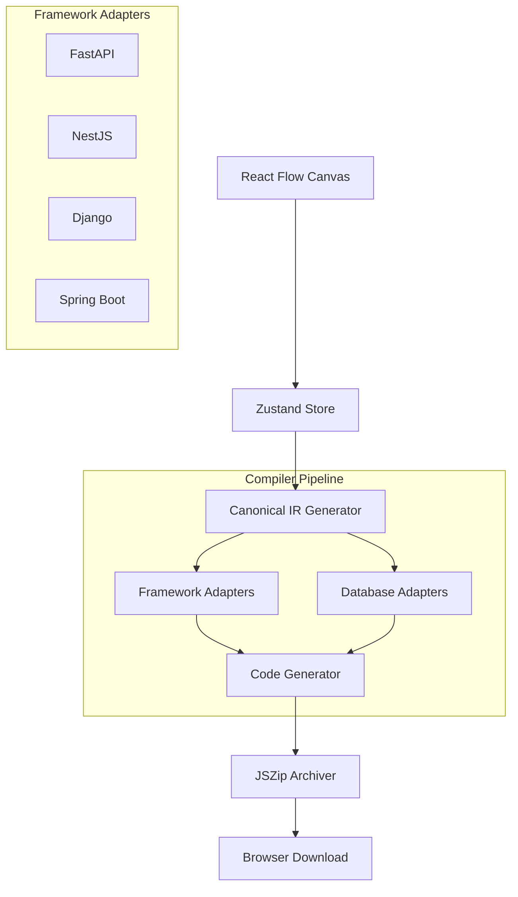

# Schema Spark

### **The Enterprise-Grade Visual ER Modeling & Backend Generation Engine.**


Schema Spark (powered by the **ERForge** engine) is a sophisticated, web-native Entity-Relationship (ER) modeling platform designed for modern software architects and data engineers. Unlike traditional diagramming tools, Schema Spark treats relationships as first-class citizens, enabling the generation of production-ready, highly-optimized backend boilerplate code across multiple languages and frameworks.

---

## 1. Executive Summary
**Schema Spark** bridges the gap between conceptual data modeling and physical implementation. It allows teams to design complex database schemas visually, define intricate business logic through relationship rules, and instantly export a fully functional backend project. 

By automating the "Boilerplate Phase" of backend development, Schema Spark reduces time-to-market while ensuring architectural consistency and best practices across the engineering organization.

---

## 2. Key Features

-   **🎨 Intuitive Visual Canvas**: Powered by React Flow, featuring smooth transitions, auto-layout, and a developer-centric UI.
-   **💎 First-Class Relationships**: Model binary and n-ary relationships with attributes, constraints, and business logic rules (recursive, identifying, etc.).
-   **🚀 Multi-Framework Code Generation**: Export production-ready projects in **FastAPI (Python)**, **Django (Python)**, **NestJS (TypeScript)**, **Express (Node.js)**, and **Spring Boot (Java)**.
-   **🗄️ Database Agnostic**: Supports **PostgreSQL**, **MySQL**, **SQLite**, **Oracle**, and **SQL Server**.
-   **📝 Logic Engine**: Define `BEFORE_CREATE`, `AFTER_UPDATE`, etc., triggers directly on relationships via a structured DSL.
-   **💾 Persistence & Recovery**: Robust autosave system using `localStorage` and a proprietary `.erforge` file format for project portability.
-   **🏗️ Industry Templates**: Jumpstart projects with pre-built models for Auth Systems, LMS, E-Commerce, and CRM.

---

## 3. Architecture Overview

Schema Spark follows a decoupled, modular architecture designed for extensibility:

-   **Frontend Layer**: A React 18 TypeScript application using `shadcn/ui` for high-fidelity interactive components.
-   **State Management**: Orchestrated by Zustand with a persistence middleware, maintaining a strictly typed `ERSchema` state.
-   **Graph Engine**: React Flow (xyflow) handles the DAG (Directed Acyclic Graph) and node-based interactions.
-   **Compiler Pipeline**: 
    1.  **Frontend State** → **Canonical IR** (Intermediate Representation).
    2.  **Canonical IR** → **Framework Adapters**.
    3.  **Framework Adapters** + **Database Adapters** → **Source Code**.
-   **Storage**: Local-first approach with exportable JSON-based `.erforge` files.

---

## 4. System Design Diagram



---

## 5. Full Tech Stack Breakdown

### **Frontend**
-   **Framework**: React 18 (Vite)
-   **Language**: TypeScript 5.x
-   **Styling**: Tailwind CSS + `lucide-react`
-   **UI Components**: shadcn/ui (Radix UI)
-   **Graph Engine**: `@xyflow/react` (React Flow)
-   **State Management**: Zustand

### **Backend Generation**
-   **Serialization**: JSZip, FileSaver
-   **Validation**: Zod
-   **Adapters**: Purpose-built TS classes for Python, Java, and Node.js code generation.

### **Development & Tooling**
-   **Build Tool**: Vite
-   **Testing**: Vitest + React Testing Library
-   **Linting**: ESLint + TypeScript-ESLint

---

## 6. Repository Structure Walkthrough

```text
schema-spark/
├── src/
│   ├── components/            # UI Components
│   │   ├── diagram/           # React Flow nodes and canvas logic
│   │   ├── export/            # Advanced code generation dialogs
│   │   ├── sidebar/           # Property editors for entities/relations
│   │   └── ui/                # shadcn base components
│   ├── lib/
│   │   ├── export/            # The "Compiler" core
│   │   │   ├── frameworks/    # Framework-specific adapters (Nest, FastAPI, etc.)
│   │   │   ├── databases/     # SQL dialect adapters
│   │   │   └── pipeline.ts    # Main transformation logic
│   │   ├── store.ts           # Global schema state (Zustand)
│   │   └── schema.ts          # Type definitions and validation rules
│   ├── pages/                 # Main entry points (Index, NotFound)
│   └── test/                  # Test suites and mocks
├── public/                    # Static assets
└── tsconfig.json              # TypeScript configuration
```

---

## 7. Installation & Setup Guide

### **Prerequisites**
-   Node.js (v18.x or higher)
-   Bun (recommended) or npm/yarn

### **Getting Started**

1.  **Clone the Repository**
    ```bash
    git clone https://github.com/RaghavSethi006/schema-spark.git
    cd schema-spark
    ```

2.  **Install Dependencies**
    ```bash
    npm install
    ```

3.  **Run Development Server**
    ```bash
    npm run dev
    ```
    Access the application at `http://localhost:5173`.

---

## 8. Configuration Guide

The application behavior can be customized via `src/lib/projectStore.ts`:

| Property | Description | Default |
| :--- | :--- | :--- |
| `autosaveEnabled` | Toggles automatic saving to localStorage | `true` |
| `sidebarWidth` | Initial width of the properties panel | `320px` |
| `sidebarPosition` | Layout orientation (Left/Right) | `right` |

For **Code Generation Defaults**, modify `defaultExportConfig` in `src/lib/export/pipeline.ts`.

---

## 9. Usage Instructions

1.  **Define Entities**: Click "Add Entity" or press `+` to create a new table. Edit fields in the right sidebar.
2.  **Model Relationships**: Drag from an entity's handle to another to create a relationship, or use "Add Relationship" for N-ary diamonds.
3.  **Define Logic**: Select a relationship to specify cardinality (1:1, 1:N, M:N) and add custom rules like "Total Participation".
4.  **Validate**: The "Export" dialog provides real-time validation for primary keys, circular dependencies, and naming conflicts.
5.  **Export**: Choose your target framework/database and download the generated ZIP containing your full project scaffold.

---

## 10. Advanced Workflows

### **Custom Logic Rules**
Schema Spark allows defining "Logic Rules" on relationships. These represent business requirements that transcend simple database constraints:
-   **Trigger**: `BEFORE_CREATE`, `AFTER_DELETE`, etc.
-   **Action**: `THROW_ERROR`, `UPDATE_FIELD`, or `LOG`.
-   **DSL**: Rules can be exported as pseudo-code or implemented as service-layer validation in the generated framework.

### **Project Portability**
Save your work by exporting a `.erforge` file. These files contain the full state of your diagram and can be shared with teammates for instant collaborative review.

---

## 11. Extension & Plugin Design

Schema Spark is designed to be easily extensible:

-   **Adding a Framework**: Implement the `FrameworkAdapter` interface in `src/lib/export/frameworks/`.
-   **Adding a Database**: Implement the `DatabaseAdapter` interface in `src/lib/export/databases/`.
-   **New Node Types**: Add custom SVG/HTML components to `src/components/diagram/` and register them in `nodeTypes`.

---

## 12. Performance Considerations

-   **Canvas Virtualization**: React Flow handles 100+ entities efficiently through internal optimization.
-   **Memory Management**: State transitions are immutable to prevent re-renders, leveraging Zustand's selective subscriptions.
-   **Bundling**: Vite's code-splitting ensures that heavy export modules (like JSZip) are only loaded when needed.

---

## 13. Security Design

-   **Local-First Privacy**: No schema data is sent to a server. All code generation happens client-side in the browser.
-   **Sanitization**: All entity and field names are passed through a Zod-based sanitizer to prevent injection attacks in generated SQL.

---

## 14. Testing & Validation

Run the test suite using Vitest:
```bash
npm test
```
The project maintains a focus on **Regression Testing** for the IR Pipeline to ensure code generation consistency across versions.

---

## 15. Deployment Strategy

Schema Spark is a static SPA. It can be deployed to:
-   **Vercel/Netlify**: Optimized for zero-config deployment.
-   **GitHub Pages**: Can be served directly via GitHub Actions.
-   **Self-Hosted**: Build the artifacts using `npm run build` and serve via Nginx/Apache.

---

## 16. Troubleshooting Guide

-   **Canvas is Blank**: Ensure you aren't using an unsupported browser. Schema Spark requires modern CSS Grid and Flexbox support.
-   **Export Fails**: Check for validation errors in the "Configure" tab of the Export Dialog. Ensure all entities have specific names.
-   **Lost Work**: Check the "Recent Projects" section on the Home page; Schema Spark stores your last 10 projects in local storage.

---

## 17. Limitations & Known Issues

-   **Circular Relationships**: Complex circular FK constraints may require manual migration ordering in some frameworks.
-   **Multi-User Real-time**: Currently lacks real-time CRDT-based collaboration (planned for v2.0).
-   **Mobile Support**: The diagramming experience is optimized for desktop (mouse/keyboard).

---

## 18. Future Roadmap

-   [ ] **AI Schema Generation**: Generate ER models from natural language prompts.
-   [ ] **Direct Deployment**: Push generated code directly to a GitHub repository.
-   [ ] **Database Inspection**: Import an existing SQL database into Schema Spark for visualization.
-   [ ] **Live SQL Editor**: Preview generated SQL DDL in real-time.

---

## 19. Contribution Guidelines

We welcome contributions! 
1.  Fork the repo and create a branch.
2.  Follow the **Coding Standards** outlined below.
3.  Ensure your changes pass all tests.
4.  Submit a PR with a detailed description of the feature or fix.

---

## 20. Coding Standards

-   **Language**: Strictly TypeScript. No `any` types.
-   **State**: Only use the Zustand store for shared global state. Avoid prop drilling beyond 2 levels.
-   **UI**: Follow the `shadcn/ui` theme system. Use CSS variables for colors.
-   **Formatting**: Prettier is enforced via ESLint.

---

## 21. License & Legal Notes

Distributed under the **SS-POL v1.0 License**. See `LICENSE` for more information.

---

**Built with ❤️ for the Engineering Community by the Schema Spark Team.**
